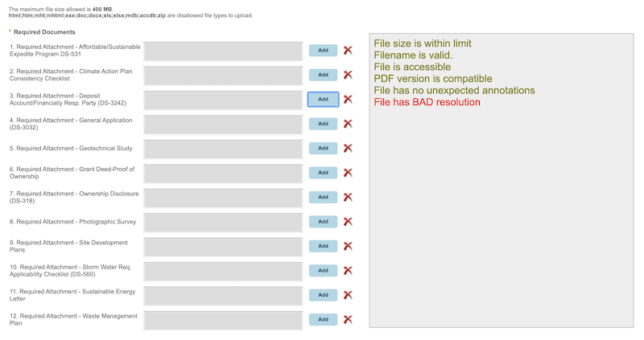

# Real-time Scout using client-side pdf.js
> Client-side PDF file analysis

Proof of concept for implemention pdf.js for client-side PDF checking. Requires only [pdf.js](https://github.com/mozilla/pdf.js) library and nothing else.

<kbd></kbd>

## Getting Started

Just open aca.html from your browser.

## Implementation hack

In order to perform client-side PDF file checking one must be be able to add Javascript code on the file upload page.  The requirement is that one has to be able to run a Javacript function after user selects file to be uploaded.  If there is an existing fucntion being run after user selects file for uploading, then a clever hack is to intercept the function. For example, given:

```sh
<input type="file" name="myPDF" onchange="validatePDF(arg)">

The JS pseudo code would be:

// save original function to another variable
var oldFunction = validatePDF;

// create new funtion to do what we want
var newFunction = function(arg) {
    // Get all "input" tags
    var uploadInputs = document.getElementsByTagName('input');

    // search for input of type=file and pass component to the Scout function
    for (var i = 0; i < uploadInputs.length; i++) {
        ...
    }

    // run original function
    oldFunction(arg)
}

// Finally, re-assign origin function to new function which include the original function
validatePDF = newFunction;


```

## Main code block

```sh
var validatedPDF = [];
if (typeof showLoading === "function") {
    // copy original function
    var oldShowLoading = showLoading;

    newShowLoading = async function(needValidate) {
        var uploadInputs = document.getElementsByTagName('input');
        for (var i = 0; i < uploadInputs.length; i++) {
            if (uploadInputs[i].type.toLowerCase() == 'file') {
                if (uploadInputs[i].value) {
                    if (validatedPDF.indexOf(uploadInputs[i].value) === -1) {
                        validatedPDF.push(uploadInputs[i].value);
                        scoutCheck(uploadInputs[i].files);
                    }
                }
            }
        }

        oldShowLoading(needValidate); //invoke original showLoading function
    }

    // run hooked function
    showLoading = newShowLoading;
}
```
## Project File Description

* aca.html - <i>main file for this poc</i>
* js/scout.js - <i>the one Javscript file to do all our stuff</i>
* js/parameter.js - <i>configuration file in JSON format</i>
* js/Analysis.js - <i>small helper Class</i>
* test folder - <i>various PDF files for testing</i>

## Technology Dependencies

* Browser that support IndexedDB and FileReader API (basically almost all modern browsers)
* [pdf.js](https://github.com/mozilla/pdf.js) 

## References

[pdf.js](https://github.com/mozilla/pdf.js)
